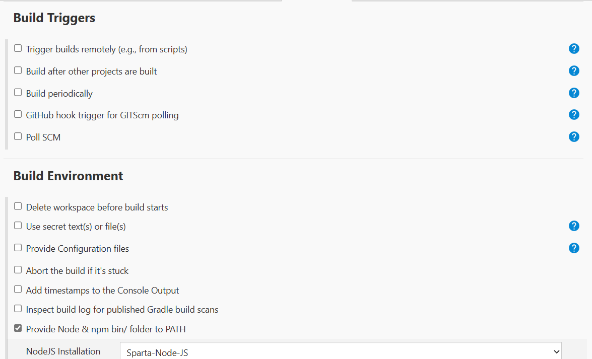

# CI/CD

### Table of contents:

[1. What is it?](https://github.com/yjk16/cicd-with-jenkins/blob/main/CICD.md#1-what-is-it)

[2. Why is it so useful?](https://github.com/yjk16/cicd-with-jenkins/blob/main/CICD.md#2-why-is-it-so-useful)

[3. Jenkins: what is it?](https://github.com/yjk16/cicd-with-jenkins/blob/main/CICD.md#3-jenkins-what-is-it)

[4. Jenkins process](https://github.com/yjk16/cicd-with-jenkins/blob/main/CICD.md#4-jenkins-process)

[5. Jenkins stages and steps](https://github.com/yjk16/cicd-with-jenkins/blob/main/CICD.md#5-jenkins-stages-and-steps)

[6. Alternatives to Jenkins](https://github.com/yjk16/cicd-with-jenkins/blob/main/CICD.md#6-alternatives-to-jenkins)

[7. How to build a job in Jenkins](https://github.com/yjk16/cicd-with-jenkins/blob/main/CICD.md#7-how-to-build-a-job-in-jenkins)

[8. Linking two jobs together on Jenkins](https://github.com/yjk16/cicd-with-jenkins/blob/main/CICD.md#8-linking-two-jobs-together-on-jenkins)

[9. To connect GitHub repo with Jenkins using ssh key](https://github.com/yjk16/cicd-with-jenkins/blob/main/CICD.md#9-to-connect-gibhub-repo-with-jenkins-using-ssh-key)

[10. To set up automated testing](https://github.com/yjk16/cicd-with-jenkins/blob/main/CICD.md#10-to-set-up-automated-testing)

[11. To trigger 'build now' automatically](https://github.com/yjk16/cicd-with-jenkins/blob/main/CICD.md#11-to-trigger-build-now-automatically)

[12. Webhooks](https://github.com/yjk16/cicd-with-jenkins/blob/main/CICD.md#12-webhooks)

[13. To create a GitHub webhook in the Jenkins pipeline](https://github.com/yjk16/cicd-with-jenkins/blob/main/CICD.md#13-to-create-a-github-webhook-in-the-jenkins-pipeline)

[14. To merge Git branches with Jenkins](https://github.com/yjk16/cicd-with-jenkins/blob/main/CICD.md#14-to-merge-git-branches-with-jenkins)

[15. Creating a build to get the code from main branch and pushing it to production](https://github.com/yjk16/cicd-with-jenkins/blob/main/CICD.md#15-creating-a-build-to-get-the-code-from-main-branch-and-pushing-it-to-production)

----

### 1. What is it?

It is a method in which some of the processes are automated to deliver a product more efficiently and more frequently.

`Continous Integration` is when all members of the team continously integrate their work into a single repository.

`Continuous Delivery` is when enough automation from the integration part of the system has been successfully tested to the point where the product can be continuously delivered. 

`Continuous Deployment` is when the process of continous delivery can be automated.  This makes things more efficient, but sometimes it is preferable to use continuous delivery.  

For example, if there is more time, you may want to deliver after checking first, in which case delivery would be preferable.

NOTE: CI/CD is considered the backbone of DevOps.

----

### 2. Why is it so useful?

It is popular in DevOps because it makes things more efficient with less human errors and ultimately speeds everything up.  It makes it easier to spot and fix bugs.

----

### 3. Jenkins: what is it?

(info from medium.com)

- Jenkins is an open source CI/CD tool written in Java

- It has a lot of plugins available

- It provides a feedback loop to fix errors

- It helps advance the SDLC (software development life cycle) faster through automation

NOTE: the SDLC = plan - design - develop - test - deploy

----

### 4. Jenkins process

In order for the continuous integration stage to happen smoothly, it is required that all members of the team continuously push the code that they have tested into a single repository.

You can set up a notification system on GitHub to automatically inform people when a new change has been pushed onto the shared repo. This is called a `webhook trigger`.

You can use Jenkins to automatically test code, and once the code has passed the test, the Master Node can send it to production, otherwise, it will go from Agent Node back to wherever the issue lies, and the process repeats.

Once the code is suitable for deployment, it can be passed to Amazon Web Services for `continuous delivery`.

If this stage can be automated, it will have reached `continuous deployment`.

You always want to deploy manually first!

You will need ssh keys to show that you have the required permissions for all of these stages.

You can use the `scp` command to get your app onto AWS via your Jenkins ssh key.

E.g. `scp -i "~/.ssh/tech230.pem" -r app ubuntu@ec2-<ip address of your instance>.eu-west-1.compute.amazonaws.com:/home/ubuntu`

You won't deploy the app until you start the process.  I.e. `npm start`.

You want to be careful deploying, as once it's done, there is no way back and the public can reach it.

----

### 5. Jenkins stages and steps

(info from cloudaffaire.com)

`Stages` contain `stage directives`

`Stage directives` contain `steps`

`Steps` are actions that you want to perform in your Jenkins' pipeline.

A multi-stage build is called a `pipeline`.

----

### 6. Alternatives to Jenkins

Alternatives to Jenkins include:

- GitLab
- Atlassian Bamboo
- CircleCI
- TeamCity
- Travis CI
- BuildMaster

----

### 7. How to build a job in Jenkins

1. Log into Jenkins
2. Click on `New Item`
3. Enter item name (use this convention: name-description. In this example `yoonji-checking-jenkins-OS)
4. Create `Freestyle project`
5. Click `OK`
6. Under `General`, click `Discard old builds` and under `Max # of builds to keep` put `3`
7. Under `Build`, `Add build step`, `Execute shell`
8. Add your commands.  If you want to find out the O/S, `uname -a` (this provides all the info of this username)
9. `Save`

The job has been successfully created.

10. Click on `Build now` to build it.

You can watch it run on `Build History`

- Red - failed
- Blue - success

To check processes, click on the dropdown menu next to the coloured circle, and click `Console Output`

If you need to change the configuration, click on `Configure` on the left hand drop-down menu, edit your changes and save them.

----

### 8. Linking two jobs together on Jenkins

1. Click on `New item` and enter an appropriate name.  For this example, `yoonji-checking-timezone`
2. `Freestyle project`, `OK`
3. Under `General`, click `Discard old builds` and under `Max # of builds to keep` put `3`
4. Under `Build`, `Add build step`, `Execute shell` and add the command `date` (which is the Linux command to find the date) and `Save`
5. Click on `Build now` to check it works and you can check `Console Output` if you want

To link the two builds together (only when they are independently successful)...

In this case, `date` is run on Linux, so you will want the first build to be successful in checking that the O/S is Linux, and if that is the case, the second build (date) will be triggered.

6. Go back to the dashboard, find the first job you created (i.e. `yoonji-checking-jenkins-OS`) and on the dropdown menu click `Configure`
7. Under `Post-build Actions`, `Build other projects`
8. Under `Projects to build` find the project you want (in this case `yoonji-checking-timezone`) NOTE: you may need to use the backspace if it says `No such project`
9. You want `Trigger only if build is stable` to be ticked
10. `Save`
11. If you `Build now` it should trigger the next job automatically

NOTE: Always test jobs manually and independently, only then link them together.  Then test again!

----

### 9. To connect GitHub repo with Jenkins using ssh key

1. Go to the Github repo that you require (in this case cicd-with-jenkins)
2. Go to `settings`
3. `Deploy keys`
4. `Add deploy key`
5. Add your `Title` and then paste in your public ssh key under `Key`
6. Click `Allow write access` then `Add key`

Then go to Jenkins

7. `New Item`, name it, (in this case `yoonji-ci`), `Freestyle project`
8. Under `General`, `Discard old builds` and enter `3` under `Max # of builds to keep` and click on `GitHub project`
9. Under `Project url` copy and paste the http code from your GitHub repo (in this case `cicd-with-jenkins`)
10. Under `Source Code Management` click `Git` and under `Repositories` in the `Repository URL` copy and paste your ssh code from your GitHub repo
11. Under `credentials`, `Add`
12. In `Add Credentials` Under `Kind`, pick `SSH Username with private key`, put in a `Username` and where it says `Private Key`, click `Enter directly` and `Add`, then paste in your private ssh key here, then `Add`
13. Under `Branches to build` where it says `Branch Specifier` you will want to change it from `master` to `main` (as this is what it is on GitHub)
14. Under `Build Environment` click `Provide Node & npm bin/ folder to PATH`
15. Under `Build`, `Execute shell`
16. Add the commands `cd app`, `npm install` and `npm test`
17. `Save`

----

### 10. To set up automated testing

1. Go to your ci job: `yoon-ji-ci`
2. Check that you have correct info from above
3. Make sure under `Office 365 Connector` you've clicked `Restrict where this project can run` and the `Label Expression` is `sparta-ubuntu-node` (If you get a warning, use the backspace)
4. Under `Build Triggers` make sure you click `GitHub hook trigger for GTIScm polling`

5. Make sure under `Build Environment` you've clicked `Provide Node & npm bin/ folder to PATH`
6. Under `Build`, `Execute shell` and add commands `cd app`, `npm install`, `npm test`
7. `Save`
8. `Build now` to check
9. Under `Build History` it will say `EC2 sparta ubuntu node` is offline.  It will kick in EC2 instances (which will be pending) and create an autoscaling group. The load balancer will be directing the load between Master and Agent. And once it is available, it will run on Jenkins.  And then you can also see that the EC2 instances are running on AWS
10. If you check the `Console Output` the tests should have passed successfully which means it is ready to be pushed for production

----

### 11. To trigger 'Build now' automatically

1. Go to the right directory in Bash
2. Change something, can use `nano README.md` for example, and save the change
3. Add, commit and push the changes onto GitHub
4. If everything has been done correctly, this should trigger the job

----

### 12. Webhooks

(info from getvero.com)

Webhooks are like reverse APIs.  Whereas APIs need to pull data from a server periodically to stay up to date, with a webhook, the server can push the data the instant something happens.

----

### 13. To create a GitHub webhook in the Jenkins pipeline

(info from hevodata.com)

1. You already have a ci build

Go to GitHub

2. Go to the appropriate repo (here `cicd-with-jenkins`), click `Settings`, then `Webhooks` and `Add webhook`
3. Fill out info. `Payload URL` is your Jenkins URL but add `/github-webhook/` at the end.  The URL should look like: `http://address:port/github-webhook/`
4. Under `Content type` pick `application json`
5. Under `Which events would you like to trigger this webhook?` pick `Just the push event`. This will only send when someone pushes to the repo.
6. `Add webhook`

You will get this notification:

NOTE: Remember that if anything changes (for example the Payload URL), you will need to update the information otherwise it won't work.

----

### 14. To merge Git branches with Jenkins

1. Create a new item `yoonji-ci-merge`
2. Under Source Code Management, click `Git` and for `Branches to build` put `*/dev`
3. Under `Additional behaviours`, choose `Merge before build`, `Name of repository` should be `origin`, `Branch to merge to` should be `main` (and other edits, refer to screenshots below...)

4. `Save` and test.

----

### 15. Creating a build to get the code from main branch and pushing it to production

1. Create a `new item`

To ssh into AWS from Jenkins, when configuring, under the `Provide Node & npm` box, click `SSH Agent` and add the relevant key.  In this case, it will be `tech230.pem`

The job should look like:

Will need to automate the process of entering by ssh so not asked to confirm.

Can use `rsync` or `scp` and disable StrictHostKeyChecking with something like the following...

`ssh -o StrictHostKeyChecking=no user@hostname`

and copy in the latest version of the app with changes into ubuntu/<instance_ip>:home/ubuntu

then

`cd app`
`pm2 kill`
`pm2 start app.js`

----

2. Make sure to edit your ci-merge.  Under `Post-build Actions`, `projects to build`, enter (in this case) `yoonji push to production`

----

3. Can ssh in from your instance to check manually...
